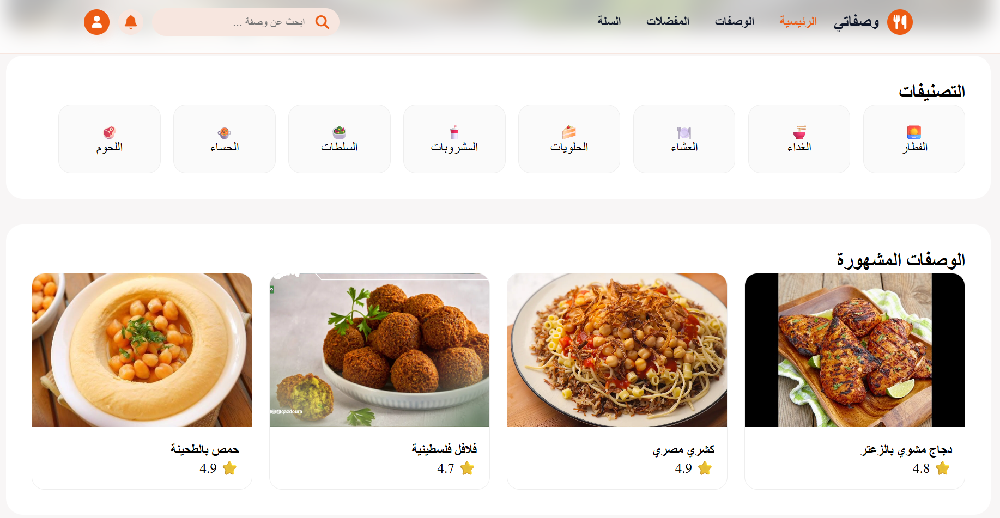
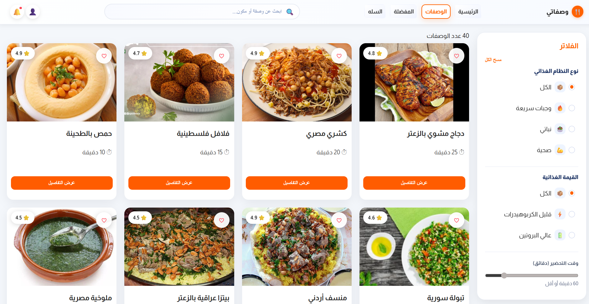
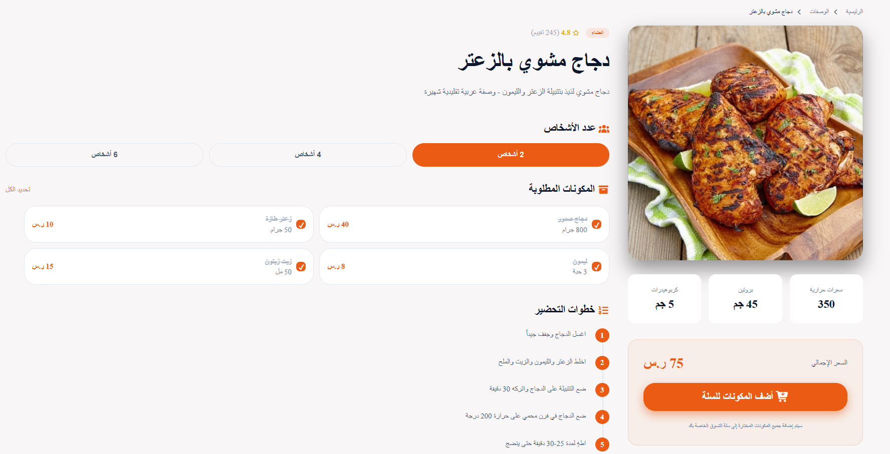
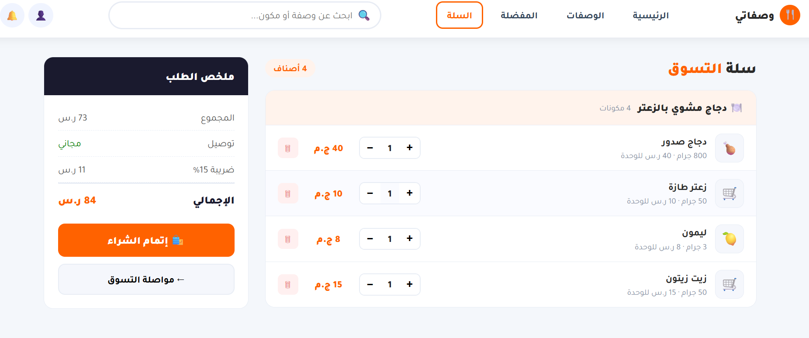

# RecipeCart

RecipeCart is a front-end web application that combines a recipe platform with an e-commerce shopping experience. Users can browse different food recipes and instantly add all the required ingredients of a selected recipe to their shopping cart with one click.

The goal of this project is to simplify grocery shopping by allowing users to select a complete recipe instead of searching for ingredients individually.

## Features

* Browse food recipes with images and details
* Search for recipes
* Filter recipes by category (Breakfast, Lunch, Dinner)
* View full recipe details and ingredients
* Add all recipe ingredients to the cart in one click
* Update ingredient quantities in the cart
* Remove items from the cart
* Automatic total price calculation
* Checkout system
* Save favorite recipes
* Cart persistence using LocalStorage

## Screenshots
| Home | Categories | Recipes |
|---|---|---|
|  |  |  |

| Recipe Details | Cart | Order |
|---|---|---|
|  |  |  |
---
## Pages

Home
Displays featured recipes and food categories.

Recipes
Shows all available recipes with image, name, and a button to view details.

Recipe Details
Displays recipe image, ingredients list, total price, and an option to add the recipe ingredients to the cart.

Cart
Displays all ingredients added from recipes with options to update quantities or remove items.

Checkout
Shows the total order price and allows the user to confirm the order.

## Technologies Used

* HTML5
* CSS3
* JavaScript (Vanilla JS)
* LocalStorage
* Git & GitHub

## Project Structure

```
RecipeCart
│
├── index.html
├── recipes.html
├── recipe-details.html
├── cart.html
├── checkout.html
│
├── css
│   └── style.css
│
├── js
│   ├── recipes.js
│   ├── cart.js
│   └── checkout.js
│
├── images
│
└── data
    └── recipes.json
```

## Team Workflow

The project is developed collaboratively using GitHub.
Each team member works on a separate feature branch and submits a Pull Request before merging changes into the main branch.

Example branches:

* home-page
* recipes-page
* recipe-details
* cart-checkout

## Project Goal

Build a modern front-end application that demonstrates team collaboration, JavaScript logic, and dynamic cart functionality while simulating a recipe-based shopping experience.
